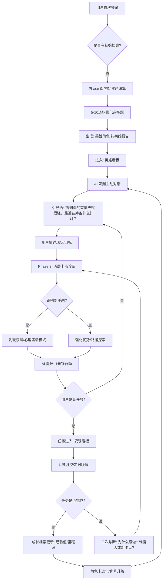

# AI 天赋挖掘

资料中明确指出，拥有天赋和技能只是基础，阻碍变现的往往是“内在操作系统”的Bug。对于独立开发者，最常见的卡点如下：

根据提供的会议记录《天赋挖掘产品迭代与商业模式探讨》，目前的“天赋挖掘”产品（主要指0.1版本的问卷+PDF报告模式）在用户反馈中暴露出了明显的问题。

以下是对所有用户反馈问题的统计与总结，主要集中在**交付形式、内容深度、行动指引和价值感知**四个维度：

### 1. 交付形式体验差：内容过载，难消化

这是目前最直接的反馈，导致用户互动率极低。

* **信息过载**：现有的PDF报告内容过多，篇幅过长，导致用户的注意力被分散，找不到重点,,。
* **难以消化**：用户反馈看完报告后感到“不好消化”，甚至只是匆匆扫一眼就过了，无法深入理解其中含义,。
* **互动率极低**：实际测试中，分发给5个用户报告，结果**没有任何一个人主动回复**，说明这种静态交付形式无法调动用户的积极性,。

### 2. 缺乏明确指引：知道“有什么”但不知“怎么做”

用户普遍反映报告缺乏落地的路径导航。

* **路径模糊**：用户看完后虽然知道了一些信息，但不知道具体下一步该干什么，缺乏明确的行动路径,。
* **非目标用户迷失**：由于报告不断塞入不同用户的个性化反馈内容，导致内容越来越杂，非特定需求的用户在阅读时容易找不到自己的重点，感到迷茫。

### 3. 诊断深度不足：无法触及核心“卡点”

这一问题在有一定自我认知的用户（如技术负责人自己）身上尤为明显，这也是你之前提到的痛点所在。

* **AI回复平庸**：单纯的问卷模式缺乏对用户“上下文”的深入了解，导致AI生成的建议比较平庸，无法像真人（如谷歌经理）那样结合日常行为洞察到深层问题,。
* **未能识别隐性卡点**：以技术负责人为例，报告虽然准确指出了“独立开发”的方向（这是用户已知的），但未能诊断出阻碍其变现的真正核心是“傲慢”和“过度关注技术、逃避销售”。这种**“只给方向、不诊病灶”**的报告让用户感到“无感”,。

### 4. 认知与预期偏差：两极分化严重

不同认知阶段的用户对产品的满意度存在巨大的差异，导致众口难调。

* **小白用户（无概念）**：对天赋没有概念的用户，看不懂报告，或者觉得这像“算命”、“玄学”，对其信任度低，不认为这能改变生活或赚钱,,,。
* **资深用户（有经验）**：做过人类图、盖洛普等测试的用户，觉得目前的报告深度不够，认为“也就那样”，没有达到预期,。
* **预期管理失败**：部分用户对产品抱有极高期待，但目前的标准化报告无法满足其高度个性化的心理需求。

### 总结

目前产品的核心症结在于：**静态的PDF报告试图用“一刀切”的内容去满足“高度个性化”的需求。**

这就导致了：

1. **对小白**太晦涩（像玄学、没落地场景）；
2. **对高手**太浅显（不抓痛点、无新意）；
3. **对所有人**都太累（字太多、没重点）。

这也是为什么团队决定向**“交互式AI工具”**转型的根本原因，旨在通过对话来解决“上下文缺失”和“个性化引导”的问题,。

天赋投资系统：用户全链路流程图 (V2.2)

一、 核心业务流程图

二、 关键设计决策审计

1. 任务标注：为什么必须标注“目的”？

逻辑：在“投资”逻辑中，用户最怕的是“无意义的忙碌”。

标注方式：

标签 A (攻克)：解决 [完美主义逃避] 卡点。

标签 B (建设)：建立 [审美套利] 商业闭环。

二阶效应：当用户在看板上看到任务不只是“干活”，而是在“排雷”和“建塔”时，执行力会显著提升。

1. 定时询问：如何实现“不啰嗦”的关怀？

逻辑：避免变成“垃圾通知”。

设计策略：

场景化触发：如果是一个“5分钟任务”，24小时后未完成则询问；如果是一个“调研任务”，3天后询问。

话术降级：不要说“你为什么还没做？”，要说“那个关于 [十八反] 的尝试，是不是遇到了什么没预料到的阻碍？我们聊聊？”

逆向思维：如果用户连续 3 次不完成任务且不回复，系统应自动进入**“休眠模式”**，并发送最后一条信息：“看来你现在需要一些独处的时间，等你准备好面对下一个卡点时，我随时都在。”

1. 任务生成：AI 如何显得“厉害”？

逻辑：AI 的厉害不在于给出的建议多宏大，而在于**“切口极小，但力道极大”**。

厉害的标志：

精准降级：当用户说“我想做自由职业”时，AI 能够给出一个“今天下午把你的作品发给一个老客户”的暴力动作。

逻辑穿透：AI 能在生成任务的同时，说出这个任务为什么能帮用户赚到第一个 1 块钱。

三、 团队沟通要点 (Talk Track)

在内部会议中，建议强调以下三个核心：

答题是“钩子”：解决用户一上来不知道聊什么的摩擦力。

看板是“资产”：让用户觉得这个系统里存着他的未来，舍不得卸载。

对话是“手术刀”：不定期切开脓肿（卡点），让用户持续处于“可行动”状态。

董事会结案提问：

关于定时询问：你希望这个询问是发生在 APP 内部的推送，还是在下次用户主动打开对话框时的“寒暄”？

关于闭环标注：你觉得“建立闭环”这个词对于普通用户（如宝妈、学生）是否太硬？我们需要一个更“Speak Human”的说法吗？
